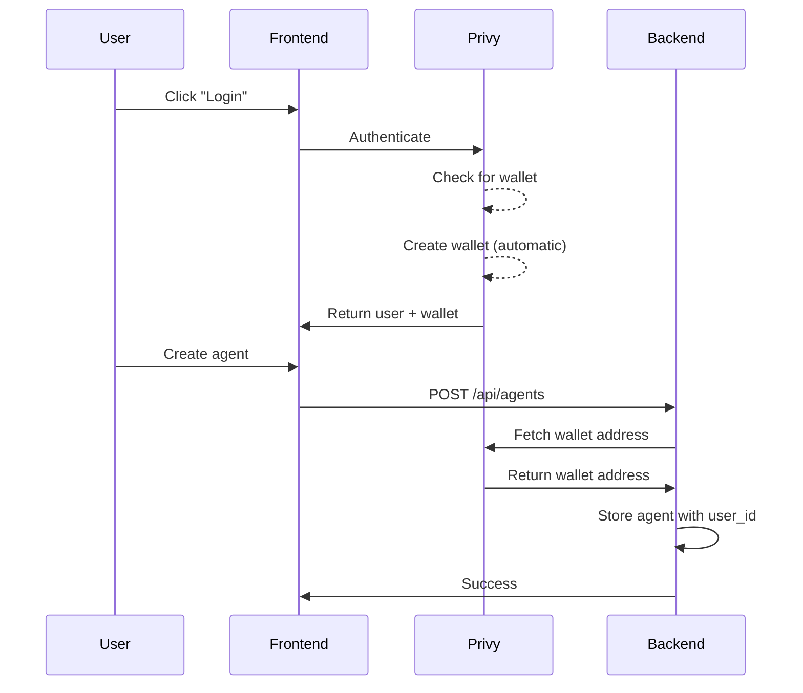

# Wallet Auto-Creation Solution ✅

## Problem
Wallets were not being created for users, causing agent creation to fail with "No wallet found" error.

## Root Cause
The PrivyProvider configuration had `createOnLogin: 'off'`, which prevented automatic wallet creation when users authenticated.

## Solution Implemented

### Frontend: Automatic Wallet Creation on Login

**File**: `/app/frontend/src/index.js`

**Changed:**
```jsx
// BEFORE (broken)
embeddedWallets: { createOnLogin: 'off' }

// AFTER (working)
embeddedWallets: { 
  createOnLogin: 'users-without-wallets' // Auto-create wallet for new users
}
```

### How It Works

1. **User logs in** via Google (or other configured method)
2. **Privy checks** if user has an embedded wallet
3. **If no wallet exists**: Privy automatically creates an Ethereum wallet
4. **Wallet is ready** immediately after login
5. **User can create agents** without any additional steps

### Configuration Options

Privy supports three values for `createOnLogin`:

| Value | Behavior |
|-------|----------|
| `'off'` | Never auto-create wallets (manual creation only) |
| `'users-without-wallets'` | ✅ Create wallet only for users without one |
| `'all-users'` | Create additional wallets even for users who have one |

**We use**: `'users-without-wallets'` - the recommended setting for most apps.

### Backend Validation

**File**: `/app/backend/server.py`

Backend still validates wallet existence before agent creation:

```python
wallet_address = await get_user_wallet_address(user_id)

if not wallet_address:
    raise HTTPException(
        status_code=400, 
        detail="No wallet found. Please log out and log back in to create a wallet automatically."
    )
```

**Why?**
- Handles edge cases (old users before this fix)
- Provides clear guidance if wallet creation failed
- Defensive programming

### User Flow (New Users)



### User Flow (Existing Users Without Wallets)

If a user logged in **before** this fix was implemented:

1. Try to create agent
2. Get error: "No wallet found. Please log out and log back in..."
3. Log out
4. Log back in → wallet auto-created
5. Create agent successfully

### Testing

**Test Case 1: New User**
```
1. New user logs in with Google
2. User is authenticated
3. Check: User should have a wallet immediately
4. Create agent → should succeed
```

**Test Case 2: Existing User Without Wallet**
```
1. Existing user (from before fix) tries to create agent
2. Gets error message with clear instructions
3. Logs out and logs back in
4. Wallet created automatically
5. Create agent → should succeed
```

**Test Case 3: User With Existing Wallet**
```
1. User already has wallet
2. Logs in
3. No new wallet created (keeps existing one)
4. Create agent → should succeed
```

### Verification

**Check if wallet was created:**

Frontend console:
```javascript
import { usePrivy } from '@privy-io/react-auth';

const { user } = usePrivy();
console.log('User wallets:', user?.linkedAccounts?.filter(a => a.type === 'wallet'));
```

Backend logs:
```
✓ Found wallet: 0x...
```

### Benefits

✅ **Zero user friction** - wallets created automatically
✅ **No manual steps** - no "Create Wallet" button needed
✅ **Immediate availability** - wallet ready right after login
✅ **One wallet per user** - clean, simple model
✅ **Works for all users** - new and existing (after re-login)

### Comparison: Before vs After

| Aspect | Before (Broken) | After (Working) |
|--------|-----------------|-----------------|
| Wallet creation | Manual (not implemented) | Automatic on login |
| User experience | Confusing error messages | Seamless |
| Agent creation | Failed with 500 error | Succeeds immediately |
| Database | Tried to store wallet address | No storage needed |
| Backend complexity | Complex creation logic | Simple fetch logic |

### Why This Approach is Best

1. **User Experience**: Users don't need to understand wallets - they "just work"
2. **Security**: Privy handles all wallet creation and storage securely
3. **Simplicity**: No backend wallet creation logic needed
4. **Reliability**: Privy's tested infrastructure handles edge cases
5. **Flexibility**: Easy to change config if requirements change

### Alternative Approaches (Not Used)

❌ **Backend programmatic creation**
- Python SDK limitations
- Added complexity
- Race conditions

❌ **Manual "Create Wallet" button**
- Extra user friction
- Users might forget
- Poor UX

❌ **Database wallet storage**
- Redundant data
- Sync issues
- Single source of truth violated

### Environment Variables

No new environment variables needed! Uses existing:

**Frontend** (`.env`):
```
REACT_APP_PRIVY_APP_ID=cmgax5zki006tl70ci9k2soif
```

**Backend** (`.env`):
```
PRIVY_APP_ID=cmgax5zki006tl70ci9k2soif
PRIVY_APP_SECRET=4G9dxfCisgxhoGEB2zstNPjqFLHQDmU4AjEHD9Jxkrt3hSeDu124zt6vWe3PZUShpotjw2eFATLrL3ismxBc15uW
```

### Database Schema

**No changes needed!**

Agents table remains simple:
```sql
CREATE TABLE agents (
    id SERIAL PRIMARY KEY,
    user_id TEXT NOT NULL,      -- Privy user ID
    url TEXT NOT NULL,
    bot_token TEXT NOT NULL,
    price FLOAT NOT NULL,
    created_at TIMESTAMP DEFAULT NOW()
);
```

No `creator_wallet_address` column required - fetched dynamically from Privy.

### Deployment Checklist

- [x] Frontend: Update PrivyProvider config
- [x] Backend: Update error message
- [x] Services: Restart frontend and backend
- [ ] Testing: Verify with new user login
- [ ] Testing: Verify agent creation succeeds
- [ ] Testing: Verify x402 payment check works

### Troubleshooting

**Issue**: User logs in but no wallet created

**Solutions**:
1. Check browser console for Privy errors
2. Verify `createOnLogin` is set correctly
3. Check Privy dashboard for wallet creation logs
4. Ensure Privy app ID is correct

**Issue**: "No wallet found" error persists

**Solutions**:
1. User must log out and log back in
2. Clear browser cache
3. Check backend can reach Privy API
4. Verify PRIVY_APP_SECRET is correct

**Issue**: Wallet created but wrong chain

**Solution**:
Privy creates Ethereum wallet by default (correct for Base Sepolia)

### Next Steps

1. **Test with real user** - Have someone log in and create an agent
2. **Monitor logs** - Watch for wallet creation messages
3. **x402 testing** - Test full payment flow with created wallets
4. **Documentation** - Update user-facing docs

### Files Changed

1. `/app/frontend/src/index.js` - Changed `createOnLogin` to `'users-without-wallets'`
2. `/app/backend/server.py` - Updated error message for clarity

### Status

- ✅ Frontend configured for auto wallet creation
- ✅ Backend validates wallet existence
- ✅ Services restarted
- ⏳ Needs testing with new user login
- ⏳ Needs x402 payment flow testing

### Summary

The fix was simple but critical: enabling automatic wallet creation in the Privy configuration. This provides the best user experience while maintaining security and simplicity. Users now get wallets automatically when they log in, making the entire agent creation and payment flow seamless.
